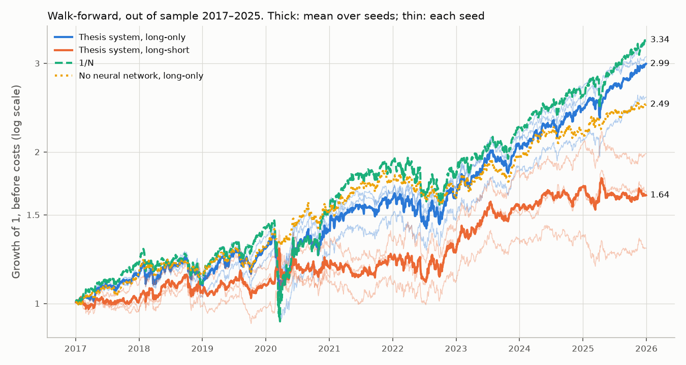

# Dual-LSTM Portfolio Allocation: a walk-forward re-evaluation

Two LSTM networks forecast, respectively, the next-day return and the
next-day volatility of eleven assets (US sector ETFs and European blue chips);
a Sharpe-inspired meta-model turns the two forecasts into portfolio weights
with a temperature softmax, a position cap and a volatility target.
Bachelor's thesis in Economics (double degree in Economics and Mathematics &
Statistics, Complutense University of Madrid, 2026), graded with *Matrícula de
Honor (Honors/Higest distinction)*.

This repository is a **re-evaluation** of that thesis, not just its code.
Preparing it for publication, I audited the original backtest and found that
the headline result (Sharpe 1.17 for the long-short strategy) was measured
mostly on the networks' own training period, that the return network's 70%
directional accuracy came from a target leak, that the risk network used in the
backtest was effectively switched off, and that no trading costs were charged.
The audit is in [`docs/AUDIT.md`](docs/AUDIT.md) and every number in it is
re-derived from the thesis's own saved models and outputs by one command.
Below are the results of the same system under a strict walk-forward
protocol, with transaction costs, several seeds, ablations and a 1/N
benchmark.

<!-- results:headline:start -->
| Sharpe ratio | Thesis (mostly in-sample, no costs) | Walk-forward, before costs | Walk-forward, 5 bps costs |
|---|---|---|---|
| Long-only | 1.03 | 0.96 | 0.59 |
| Long-short | 1.17 | 0.47 | -0.07 |
| 1/N on the same 11 assets |  | 0.88 | 0.88 |
<!-- results:headline:end -->

**In short.** Out of sample, the system does not beat holding the same eleven
assets in equal weights, and the networks are not what drives its results:

- **Long-only** earns a Sharpe ratio of 0.96 before costs against 0.88 for
  1/N, a difference well inside the noise (95% interval −0.23 to +0.41). The
  same portfolio rules fed a plain moving average and an EWMA volatility
  instead of the networks score 1.01. After 5 bps of costs the strategy falls
  to 0.59, below 1/N.
- **Long-short** is the one place where the return network adds something
  over a moving average (0.47 against 0.12), but the gain is not significant
  (p = 0.30), turns negative after 5 bps of costs, and vanishes if trades are
  executed one day later.
- **The forecasts themselves** carry no detectable signal: the return network's
  daily cross-sectional rank correlation with realised returns is 0.006
  (t = 0.8), and the risk network forecasts volatility worse than an EWMA
  (Diebold–Mariano statistic +3.3).

This is a negative result, reported as such: daily returns of liquid assets
are hard to predict, and 1/N is hard to beat out of sample (DeMiguel,
Garlappi and Uppal, 2009).



---

## Results

Walk-forward, 2017–2025: for each year, both networks are retrained from
scratch on all data before that year (last 15% held out for early stopping)
and then forecast every day of that year. Nine folds, three seeds each.
Daily rebalancing, profit and loss on raw returns. Sharpe ratios are the mean
over seeds with the range across seeds in parentheses; other columns are means over seeds,
before costs.

<!-- results:main:start -->
| Strategy | Sharpe | Sharpe @5 bps | Sharpe @10 bps | CAGR | Vol | Max DD | Turnover/day |
|---|---|---|---|---|---|---|---|
| **Long-only** |  |  |  |  |  |  |  |
| Thesis system: LSTM μ + LSTM σ | 0.96 (0.85 to 1.05) | 0.59 (0.46 to 0.67) | 0.21 (0.08 to 0.30) | 13.4% | 14.1% | -24.8% | 0.42 |
| ↳ same, executed one day later | 0.75 (0.68 to 0.78) | 0.38 (0.32 to 0.42) | 0.01 (-0.05 to 0.05) | 10.2% | 14.5% | -22.6% | 0.42 |
| LSTM μ + EWMA σ | 0.93 (0.81 to 1.03) | 0.54 (0.41 to 0.65) | 0.15 (0.01 to 0.26) | 12.3% | 13.3% | -25.9% | 0.41 |
| EMA μ + LSTM σ | 1.01 (1.00 to 1.03) | 0.64 (0.63 to 0.65) | 0.27 (0.25 to 0.28) | 11.8% | 11.6% | -13.6% | 0.35 |
| EMA μ + EWMA σ (no neural network) | 1.01 | 0.63 | 0.24 | 11.0% | 11.0% | -14.4% | 0.33 |
| 1/N, rebalanced daily | 0.88 | 0.88 | 0.87 | 14.9% | 17.4% | -37.0% | 0.01 |
| **Long-short** |  |  |  |  |  |  |  |
| Thesis system: LSTM μ + LSTM σ | 0.47 (0.29 to 0.64) | -0.07 (-0.27 to 0.11) | -0.61 (-0.83 to -0.42) | 5.7% | 13.6% | -19.3% | 0.58 |
| ↳ same, executed one day later | -0.02 (-0.13 to 0.12) | -0.56 (-0.68 to -0.42) | -1.10 (-1.23 to -0.96) | -1.1% | 13.5% | -33.5% | 0.58 |
| LSTM μ + EWMA σ | 0.48 (0.28 to 0.72) | -0.09 (-0.31 to 0.17) | -0.66 (-0.90 to -0.39) | 5.5% | 12.5% | -19.7% | 0.57 |
| EMA μ + LSTM σ | 0.13 (0.11 to 0.15) | -0.31 (-0.33 to -0.30) | -0.75 (-0.76 to -0.74) | 0.8% | 14.0% | -23.4% | 0.49 |
| EMA μ + EWMA σ (no neural network) | 0.12 | -0.34 | -0.80 | 0.7% | 13.5% | -22.7% | 0.49 |
<!-- results:main:end -->

How to read it. The long-only strategies have lower volatility and much
smaller drawdowns than 1/N because the rules hold only five assets, leave
cash when the 30% cap binds and scale down when forecast volatility exceeds
15%. That is a property of the rules, and it is just as present without the
networks (bottom long-only rows). The "executed one day later" row is the
check for the US/European close-time mismatch: the long-short strategy's
gross gain disappears entirely, so whatever short-lived signal it had cannot
be separated from that effect.

### Is any of this different from chance?

Paired moving-block bootstrap of the daily returns (seed-averaged portfolios,
20-day blocks, 5,000 resamples):

<!-- results:significance:start -->
| Sharpe difference | Estimate | 95% CI | p-value |
|---|---|---|---|
| Thesis system: LSTM μ + LSTM σ − 1/N, rebalanced daily (long-only, 0 bps) | +0.11 | [-0.23, +0.41] | 0.54 |
| Thesis system: LSTM μ + LSTM σ − 1/N, rebalanced daily (long-only, 5 bps) | -0.27 | [-0.63, +0.04] | 0.09 |
| Thesis system: LSTM μ + LSTM σ − EMA μ + EWMA σ (no neural network) (long-only, 0 bps) | -0.01 | [-0.50, +0.42] | 0.99 |
| Thesis system: LSTM μ + LSTM σ − EMA μ + EWMA σ (no neural network) (long-short, 0 bps) | +0.40 | [-0.35, +1.18] | 0.30 |
| EMA μ + EWMA σ (no neural network) − 1/N, rebalanced daily (long-only, 0 bps) | +0.13 | [-0.43, +0.71] | 0.75 |
<!-- results:significance:end -->

### What the networks themselves forecast

<!-- results:forecasts:start -->
| Out of sample, 2017–2025 | LSTM (mean over seeds, range) | Baseline | Reference |
|---|---|---|---|
| Directional accuracy, all (day, asset) pairs | 50.7% (50.6% to 50.8%) | 50.8% (EMA) | 53.5% (always up) |
| Mean daily cross-sectional IC (Spearman) | 0.006 (0.002 to 0.010) | -0.006 (EMA) | 0 |
| t-statistic of the mean IC | 0.80 (0.33 to 1.24) | -0.78 (EMA) |  |
| QLIKE (lower is better) | -7.458 (-7.469 to -7.447) | -7.630 (EWMA) |  |
| Diebold–Mariano vs EWMA (negative = LSTM better) | 3.31 (3.01 to 3.52) |  |  |
| Calibration E[r²/σ̂²] (1 = calibrated) | 1.48 (1.46 to 1.50) | 1.21 (EWMA) | 1 |
<!-- results:forecasts:end -->

The information coefficient is the daily rank correlation, across the eleven
assets, between forecast and realised return. It is what a selection rule
actually uses: not whether each forecast has the right sign, but whether the
assets forecast to do better do better *on the same day*.

Per-year returns, the VaR backtest of the forecast portfolio volatility, and
all metrics at full precision are in [`results/walkforward/`](results/walkforward).

---

## What changed relative to the thesis

| | Thesis | This repository |
|---|---|---|
| Evaluation | One fit on 2014–2022, backtest over 2014–2025 (84% in-sample) | Annual walk-forward, test years only |
| Return target | `r_t − EMA_t`, which contains `r_t` | `r_t − EMA_{t−1}` |
| Risk network in the backtest | Fed unscaled inputs: constant σ̂ | Scaler stored with the network |
| Profit and loss | Winsorised returns, full-sample quantiles | Raw returns |
| Costs | None (turnover 0.40–0.51/day) | 0, 5, 10 bps on drift-adjusted turnover |
| Runs | One, since overwritten (a rerun gave 0.76) | Three seeds per fold, forecasts committed |
| Data | Downloaded "until today" | Frozen snapshot, SHA-256 checked |
| Benchmark | S&P 500 and IBEX 35 price indices | 1/N on the same assets, same accounting |

Architecture, loss functions, hyperparameters and the meta-model are the
thesis ones; the equivalence is tested against the original code and the
saved thesis models. The one change to training (an initial value for the risk
network's output bias) and its reason are in
[`docs/METHOD.md`](docs/METHOD.md#2-the-two-networks).

---

## Reproducing

### Install

```bash
git clone https://github.com/jmolinero40/LSTM-Portfolio-Allocation.git
cd LSTM-Portfolio-Allocation
python -m venv .venv
source .venv/bin/activate          # Windows: .venv\Scripts\Activate.ps1
pip install -e ".[dev]"
```

Python 3.10–3.13, CPU only. Exact versions behind the committed results are in
`requirements-lock.txt`.

### Three levels, from seconds to hours

| Command | What it regenerates | Time | Exact? |
|---|---|---|---|
| `python -m lstm_portfolio.report --update-readme` | Every table, the figure and the README blocks, from the committed forecasts | ~10 s | Yes: CI checks it on every commit |
| `python scripts/audit/reproduce_audit.py` | Every number in `docs/AUDIT.md`, from the thesis's own files | ~1 min | Yes |
| `python -m lstm_portfolio.walkforward` | The forecasts themselves: 54 network trainings | ~1.5 h on 2 CPU cores | Same machine and versions: yes. Otherwise close, not bit-for-bit |

(`make report`, `make audit`, `make reproduce` do the same.) Network training
on CPU is deterministic for a given machine and library version, not across
them (expect per-seed differences of the order of the spread between seeds);
that is why the trained forecasts are committed and why results are
reported across seeds rather than for one run.

### Tests

```bash
pytest                       # ~2 min, no download needed
pytest -m "not tf and not slow"   # ~10 s
```

Besides unit tests, the suite checks four things that carry the argument of
this repository:

- **No look-ahead** ([`test_no_lookahead.py`](tests/test_no_lookahead.py)):
  data after a given day are replaced with noise, the whole pipeline (including
  network training) is rerun, and every forecast and weight up to that day must
  be unchanged.
- **Equivalence with the thesis** ([`test_thesis_equivalence.py`](tests/test_thesis_equivalence.py)):
  the meta-model against the original `Carteras.py`, the networks against the
  saved thesis models.
- **The audit** ([`test_audit.py`](tests/test_audit.py)): its key numbers,
  recomputed from the thesis artefacts.
- **The README** ([`test_results_consistency.py`](tests/test_results_consistency.py)):
  the tables above are exactly what the code produces from the committed
  forecasts.

---

## Repository layout

```
├── configs/
│   ├── walkforward.yaml     every parameter behind the README numbers
│   └── smoke.yaml           two-minute end-to-end check
├── data/
│   ├── snapshot/            frozen prices (CSV, hashed)
│   └── README.md            provenance and processing
├── docs/
│   ├── AUDIT.md             what was wrong with the thesis backtest, with evidence
│   ├── METHOD.md            the protocol in full, and every deviation from the thesis code
│   └── images/
├── legacy/                  the thesis code and artefacts, unmodified (see its README)
├── results/
│   ├── walkforward/         forecasts, daily returns, metrics, tables
│   └── audit/               numbers behind docs/AUDIT.md
├── scripts/audit/           re-derives the audit from legacy/
├── src/lstm_portfolio/
│   ├── data.py              snapshot, hash check, returns
│   ├── features.py          winsorisation, lagged EMA, EWMA volatility, windows
│   ├── folds.py             walk-forward schedule
│   ├── models.py            the two LSTM forecasters (network + scalers)
│   ├── portfolio.py         the meta-model (port of Carteras.py)
│   ├── backtest.py          weights → PnL, drift, turnover, costs
│   ├── metrics.py           performance, bootstrap, IC, QLIKE, DM, VaR tests
│   ├── walkforward.py       stage 1: train and forecast
│   └── report.py            stage 2: portfolios, tables, figure
└── tests/
```

---

## Citation

```bibtex
@thesis{molinero2026lstm,
  author = {Molinero Araguas, Javier},
  title  = {Optimizaci{\'o}n de carteras financieras bajo arquitecturas de
            redes neuronales recurrentes {LSTM}},
  type   = {Bachelor's thesis},
  school = {Complutense University of Madrid},
  year   = {2026}
}
```

## Licence

Code under the [MIT Licence](LICENSE). The price data come from Yahoo Finance
and are not covered by it; see [`data/README.md`](data/README.md).

## Acknowledgements

Thesis supervised by Pilar Grau Carles, Faculty of Economics and Business,
Complutense University of Madrid.
